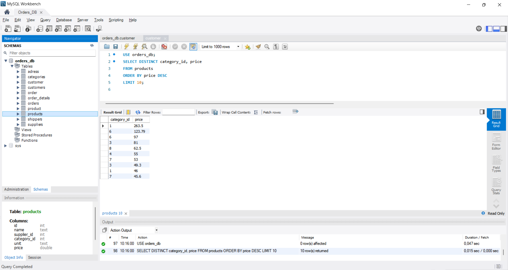
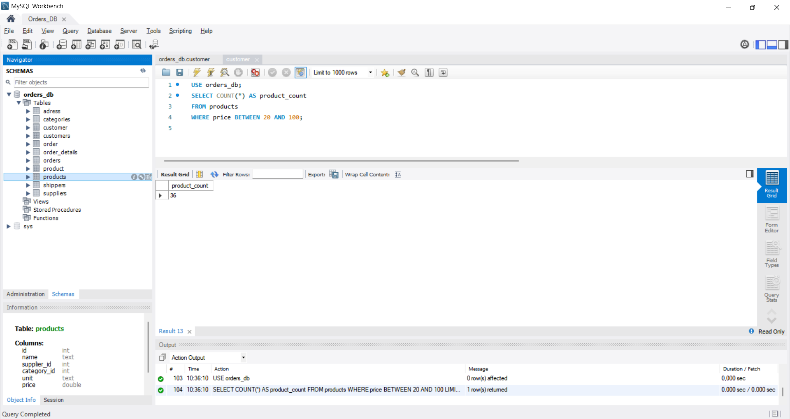
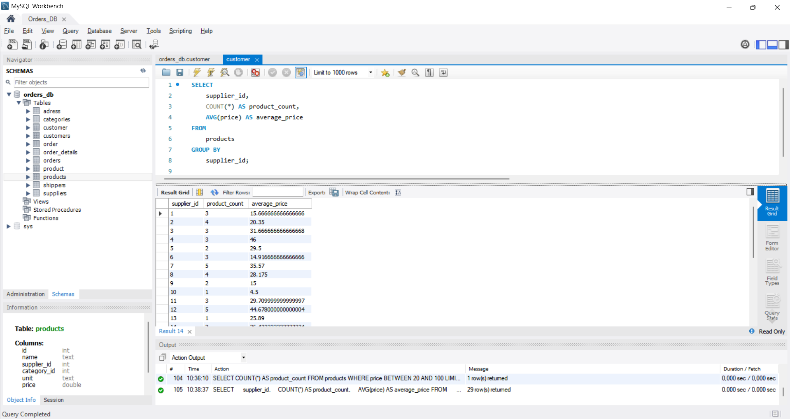

## Home task. The fundamentals of data loading, SQL operations, and DQL (Data Query Language) commands.

#### Task Instructions

1. Write an SQL command to:

- Select all columns using the wildcard (\*) from the "products" table.
- Select only the "name" and "phone" columns from the "shippers" table.
- Verify its execution in MySQL Workbench.
  
  

2. Write an SQL command to:

- Find the average, maximum, and minimum values of the "price" column in the "products" table.
- Verify its execution in MySQL Workbench.
  

3. Write an SQL command to:

- Select unique values from the "category_id" and "price" columns.
- Order the results in descending order of price.
- Limit the output to 10 rows.
- Verify the command's execution in MySQL Workbench.
  

4. Write an SQL command to:

- Find the number of products (rows) within the price range of 20 to 100.
- Verify its execution in MySQL Workbench.
  

5. Write an SQL command to:

- Find the number of products (rows) and the average price for each supplier (supplier_id).
- Verify its execution in MySQL Workbench.
  
